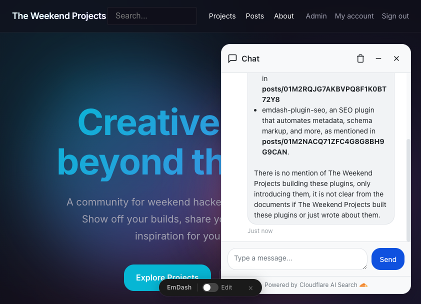
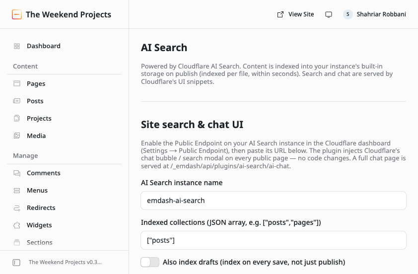

<div align="center">

# 🔍 emdash-ai-search

### Drop‑in **AI search + chat** for [EmDash CMS](https://github.com/emdash-cms/emdash) — powered by Cloudflare AI Search.

**Publish a post → it's searchable and answerable by an AI chatbot in seconds.**
No vector database to run. No embeddings pipeline to babysit. No chat UI to build.

[](https://www.npmjs.com/package/emdash-ai-search)
[](https://www.npmjs.com/package/emdash-ai-search)
[](./LICENSE)
[](https://github.com/emdash-cms/emdash)
[](https://developers.cloudflare.com/ai-search/)

**[Live demo](https://theweekendprojects.com)** · **[npm](https://www.npmjs.com/package/emdash-ai-search)** · **[Quickstart](#️-setup--step-by-step)**

<br />



</div>

---

## ✨ What you get

Add this plugin, point it at a Cloudflare AI Search instance, and your EmDash site gets:

- 💬 **A grounded AI chat bubble** on every page — answers questions from *your* content, with citations, and says "I don't know" instead of hallucinating.
- ⌘ **A `Cmd/Ctrl+K` search modal** — instant semantic search across your posts and pages.
- ⚡ **Near‑instant indexing** — hit Publish, and the post is retrievable in **seconds**. (The old "sync your bucket every few hours" model is gone.)
- 🧹 **Self‑healing index** — unpublish or delete a post and it drops out of search automatically.
- 🎛️ **A one‑screen admin** — pick collections, toggle the bubble, set a theme color. Done.

All the hard parts — chunking, embeddings, hybrid (vector + keyword) search, reranking, and answer generation — are **Cloudflare's managed service**. This plugin is the thin, reliable glue.

```
┌─────────────┐   publish/update/delete   ┌────────────────────────────┐
│  EmDash CMS │ ─────────────────────────▶ │  Cloudflare AI Search      │
│  (your      │                            │  • chunk + embed + index   │
│   content)  │ ◀───── chat & search ───── │  • hybrid search + rerank  │
└─────────────┘   (Cloudflare UI widget)   │  • grounded generation     │
                                            └────────────────────────────┘
```

---

## 🚀 Why people like it

| | |
|---|---|
| **Seconds, not hours** | Content is uploaded per‑file to AI Search built‑in storage and indexed immediately — no R2 crawl, no multi‑hour sync. |
| **Tokenless** | Runs as a native EmDash plugin and reaches Cloudflare through a Workers binding. No API key sitting in your database. |
| **No UI to maintain** | The chat bubble and search modal are Cloudflare's own open web components — you never ship, style, or patch a widget. |
| **Costs ~nothing to start** | Built on Cloudflare's free tiers; default embedding + reranking models are free, and a small site stays inside the Workers AI free allowance. |
| **Honest by design** | Answers are grounded in your content and cite their sources. It's a thin bridge, not a black box. |

---

## ⏱️ 60‑second overview

```js
// astro.config.mjs
import emdash from "emdash/astro";
import aiSearch from "emdash-ai-search";

export default defineConfig({
  integrations: [
    emdash({
      plugins: [aiSearch()], // that's the whole code change
    }),
  ],
});
```

```jsonc
// wrangler.jsonc — bind the AI Search namespace (tokenless)
{
  "ai_search_namespaces": [
    { "binding": "AI_SEARCH", "namespace": "default" }
  ]
}
```

Then create an AI Search instance, flip on its public endpoint, paste the URL into the plugin admin — and publish a post. The bubble answers questions about it moments later. Full walkthrough below. 👇

---

## 📋 Requirements

- A **Cloudflare account** with **AI Search** enabled.
- An EmDash site on **Cloudflare Workers**, using **Astro 6 + `@astrojs/cloudflare` v13+** (needed for the `cloudflare:workers` env import this native plugin uses).
- **Node 18+** and **wrangler** (`npx wrangler`).

> This is a **native (trusted) EmDash plugin** — registered via `plugins: []` in `astro.config.mjs`. It's tokenless: it talks to AI Search through a Workers binding, so there's no API token to store.

---

## 🛠️ Setup — step by step

The plugin does nothing until a Cloudflare AI Search instance exists and its public endpoint is on. Do these in order.

### 1. Create an AI Search instance

Use **built‑in storage** (the plugin uploads files to it directly — no external data source to connect):

```sh
npx wrangler ai-search create my-search --type builtin
```

`my-search` is the instance name — you'll paste it into the plugin admin. Prefer clicks? Create it from the dashboard: **Cloudflare → AI → AI Search → Create**, choosing built‑in storage. Enabling **hybrid search** here is recommended (better results, still free with the default models).

### 2. (Optional) Choose the generation model

By default AI Search answers with a Workers AI model — zero config. To use a different or third‑party model, set it on the **instance** (via AI Gateway). See [Choosing the generation model](#-choosing-the-generation-model). The plugin never overrides the model.

### 3. Enable the public endpoint

The chat/search widgets talk to the instance's public endpoint.

1. Dashboard → **AI Search → your instance → Settings → Public Endpoint**.
2. Turn on **Enable Public Endpoint**.
3. Copy the URL — `https://<id>.search.ai.cloudflare.com/`. You'll paste it into the admin.

### 4. Allow your site's origin (CORS) — ⚠️ don't skip this

> **The #1 setup mistake.** If the origin your site is served from isn't allow‑listed, the browser blocks the request — the bubble renders but chat/search fail with a **CORS error** in the console.

In the same **Settings → Public Endpoint** panel, under **Authorized hosts**, add **every hostname your site is served from** — one per line:

- your production domain, e.g. `example.com`
- your `www` subdomain if you use one, e.g. `www.example.com`
- any other origin that serves the site — e.g. a `*.workers.dev` preview URL
- (for local dev) `localhost:4321`

> ⚠️ **Each hostname is a separate origin.** `example.com`, `www.example.com`, and `your-app.workers.dev` are three different origins to the browser — a custom domain **does not** cover its `www.` or the underlying `workers.dev` URL. If you add a custom domain later (or deploy behind one), come back and add it here, or the chat bubble will break with a CORS error even though it renders fine.

Save. This is a browser control (it stops *other* sites embedding your widget), not access control.

### 5. Add the wrangler binding

Add the AI Search **namespace binding** to your site's `wrangler.jsonc`. The binding **name must be `AI_SEARCH`**:

```jsonc
{
  "compatibility_date": "2026-03-27",
  "ai_search_namespaces": [
    { "binding": "AI_SEARCH", "namespace": "default" }
  ]
}
```

The instance must exist (step 1) before you deploy.

> **Namespace vs. instance.** This binding points at a *namespace* (a container of many instances), not one instance. The plugin picks the specific instance **by name** at runtime — `env.AI_SEARCH.get(<AI Search instance name>)`, where the name is the admin setting from step 7. So the `namespace` here must contain your instance, and the admin field must hold that instance's exact name. Default namespace? Leave it as `"default"` and just set the instance name in admin.

### 6. Install and register the plugin

```sh
pnpm add emdash-ai-search
```

```js
// astro.config.mjs
import emdash from "emdash/astro";
import aiSearch from "emdash-ai-search"; // default export = native descriptor

export default defineConfig({
  integrations: [
    emdash({
      plugins: [aiSearch()], // native plugins go in `plugins`, not `sandboxed`
    }),
  ],
});
```

Deploy your site (`wrangler deploy`, or your usual build + deploy).

### 7. Configure the plugin in admin

Open **EmDash Admin → Plugins → AI Search** and set:

- **AI Search instance name** — the exact instance name from step 1 (inside the bound namespace). Must match the dashboard name character‑for‑character.
- **Indexed collections** — a JSON array, e.g. `["posts","pages"]`. Empty = index everything.
- **Public endpoint URL** — from step 3.
- **Show floating chat bubble** — on by default.
- **Show Cmd/Ctrl+K search modal** — optional.
- **Snippet theme / Accent color** — light/dark and primary color.

Save.

### 8. Verify 🎉

1. **Publish a post.** It uploads and indexes within seconds. (Existing content? Hit **Reindex "&lt;collection&gt;" now**.)
2. **Open a public page.** The chat bubble appears in the corner. Ask it about your content — you'll get a grounded, cited answer.
3. **No bubble?** Re‑check **CORS (step 4)** and that the **Public endpoint URL** is set.

---

## 🔁 How indexing works

You never trigger indexing manually for new content — the plugin rides EmDash's content lifecycle:

| Event | What happens |
|---|---|
| `content:afterPublish` | Upload to AI Search built‑in storage → indexed per file, immediately |
| `content:afterSave` | Same — **only if "Also index drafts" is on** |
| `content:afterUnpublish` | Item removed from the index |
| `content:afterDelete` | Item removed from the index |

- Only **published** content is indexed (unless "Also index drafts" is on).
- Only collections in **Indexed collections** are indexed (empty = all).
- **Unchanged content is skipped.** A content hash per document means re‑publishing or re‑indexing an unchanged post costs nothing. Flip **Force reindex** in admin to re‑upload everything (e.g. after recreating an instance).
- Documents over AI Search's 4 MB item limit are safely truncated for indexing.

### Indexing an existing archive (backfill)

New content indexes on publish automatically. For content that existed **before** you installed:

- **Small collections:** click **Reindex "&lt;collection&gt;" now** (synchronous, reliable).
- **Large archives:** **Start backfill** seeds a resumable, batched job. ⚠️ *See [Known limitations](#-known-limitations).*

---

## 🎨 The chat & search UI

Instead of shipping a widget, the plugin injects Cloudflare's official web components site‑wide via EmDash's `page:fragments` hook:

- `<chat-bubble-snippet>` — floating chat bubble
- `<search-modal-snippet>` — `Cmd/Ctrl+K` search modal

Nothing is injected until you set the **Public endpoint URL**.

**Colors & theme** come from Cloudflare's snippet, in two layers:

- **Cloudflare dashboard configurator** (Settings → Public Endpoint) — the baked‑in defaults (primary color, radius, focus ring…).
- **Plugin admin overrides** — the **Accent color** field sets `--search-snippet-primary-color`, and **Snippet theme** sets `auto | light | dark`. Page‑level overrides win; leave accent blank to inherit the dashboard config.

---

## ⚙️ Settings reference

All in **Admin → Plugins → AI Search** — one screen, no config files.

<div align="center">
  
</div>

| Setting | What it does | Default |
|---|---|---|
| **AI Search instance name** | Which instance (by name, inside the bound `AI_SEARCH` namespace) the plugin reads/writes | `emdash-ai-search` |
| **Indexed collections** | JSON array of collections to index; empty = all | `[]` |
| **Also index drafts** | Index on every save, not just publish | off |
| **Force reindex** | Re‑upload even unchanged posts on the next reindex/backfill | off |
| **Results per query** | Max results the plugin's `/search` route requests | 20 |
| **Public endpoint URL** | The instance endpoint the widgets use | — |
| **Show floating chat bubble** | Inject the bubble site‑wide | on |
| **Show Cmd/Ctrl+K search modal** | Inject the search modal site‑wide | off |
| **Snippet theme** | `auto` / `light` / `dark` | auto |
| **Accent color (hex)** | Overrides the snippet's primary color | — |
| **Cloudflare Account ID / API Token** | *Sandboxed REST mode only* — leave blank for native | — |

**Set on the Cloudflare instance instead (not here):** the generation model, chunk size, and hybrid‑search options.

---

## 🤖 Choosing the generation model

The model belongs to the **instance**, not this plugin.

- **Default:** a Workers AI model — no config.
- **Bring your own:** attach a provider key via **AI Gateway** and pick the model in the instance settings ([Cloudflare guide](https://developers.cloudflare.com/ai-search/how-to/bring-your-own-generation-model/)).

The plugin deliberately never sends a model override (doing so makes the managed instance error). Change it on Cloudflare's side and the bubble picks it up.

---

## 🧭 Routes

Under `/_emdash/api/plugins/ai-search/`:

| Route | Method | Purpose |
|---|---|---|
| `search` | POST | Query the instance; ranked results. Public. |
| `ai-chat` | GET | Standalone chat page. Public. *(see limitations)* |
| `index` | POST | Reindex one collection (admin). |
| `sync` | POST | Reindex all selected collections. |
| `status` | GET | Status info for the admin. |
| `admin` | — | Drives the Block Kit admin panel. |

---

## ⚠️ Known limitations

Being upfront so there are no surprises. None of these affect the everyday flow (publish → searchable → chat → delete), which is fully working.

- **Bulk backfill of a pre‑existing archive can stall.** The background backfill drainer relies on the EmDash `cron` hook, which isn't dispatched in every native deployment, so a **Start backfill** job may not advance. **New/edited content is unaffected** (it indexes on publish), and **"Reindex &lt;collection&gt; now"** works synchronously for existing collections. Tracked in [#2](https://github.com/theweekendprojects/emdash-ai-search/issues/2). A cron‑independent bulk reindex is the planned follow‑up.
- **The standalone `/ai-chat` page route returns JSON, not HTML.** The full‑page chat route doesn't render yet — but the **chat bubble** (the primary UX) works. Tracked in [#3](https://github.com/theweekendprojects/emdash-ai-search/issues/3).
- **Admin styling exposes one color, not the full palette.** You can set the primary/accent color and theme in admin; richer knobs (border radius, hide‑branding, a real color picker) live in Cloudflare's dashboard configurator for now. Enhancement tracked in [#4](https://github.com/theweekendprojects/emdash-ai-search/issues/4).
- **Indexing is fast but not instant.** Publishing queues an upload that Cloudflare indexes per file — typically **searchable in a few seconds**, deletions clear in **under a minute**. Don't expect the same millisecond after Publish.

---

## 🩺 Troubleshooting

| Symptom | Fix |
|---|---|
| Chat bubble doesn't appear | Set the **Public endpoint URL** in admin; confirm your origin is in **Authorized hosts** (CORS). |
| Bubble appears but chat/search fails (CORS error in console) | The exact origin serving the page isn't in **Authorized hosts**. Add it — **including a custom domain and its `www.`** separately (each hostname is its own origin). Also confirm **Enable Public Endpoint** is on and the URL is right. |
| `AI_SEARCH namespace binding missing` | Add `ai_search_namespaces` (binding `AI_SEARCH`) to `wrangler.jsonc`, redeploy; the instance must exist first. |
| `cloudflare:workers` import fails to build | Upgrade to Astro 6 + `@astrojs/cloudflare` v13+. |
| New posts not searchable | Confirm the collection is in **Indexed collections**; give it a few seconds. |
| Existing posts not indexed after install | Use **Reindex "&lt;collection&gt;" now**. (Bulk backfill may stall — see [#2](https://github.com/theweekendprojects/emdash-ai-search/issues/2).) |
| Chat says "I don't have that information" | That topic isn't indexed yet — publish/reindex the relevant content. |
| Want a different chat model | Set it on the Cloudflare instance (AI Gateway), not the plugin. |

---

## 🏗️ How it works (architecture)

```
EmDash content lifecycle                 Cloudflare AI Search (managed)
  publish / save / unpublish / delete ──▶  built‑in storage (Items API)
        │                                    └ chunk + embed + index (per file, immediate)
        │
  page:fragments hook ──────────────────▶  inject <chat-bubble-snippet> / <search-modal-snippet>
        │                                    └ served from the instance public endpoint
        ▼
  admin (instance · endpoint · collections · bubble/theme · force reindex)
```

Key files:

- `src/index.ts` — native descriptor factory `aiSearch()` (build‑time).
- `src/native.ts` — native runtime entry (reads the `AI_SEARCH` binding).
- `src/plugin.ts` — sandboxed REST entry (source only; not shipped on npm — the published package is native).
- `src/core.ts` — shared hook + route bodies, settings loader.
- `src/snippets.ts` — builds the Cloudflare UI snippet fragments.
- `src/admin.ts` — Block Kit admin page (settings + backfill/reindex actions).
- `src/services/ai-search-client.ts` — AI Search client (binding + REST).
- `src/services/ai-search-backend.ts` — indexing / search / chat + content‑hash dedup.
- `src/services/backfill.service.ts` — resumable, crash‑safe backfill engine.

Plugin storage (provisioned by the host): `backfill_job` (durable job) and `doc_state` (per‑document content‑hash dedup).

---

## 💬 Honest positioning

This is a thin, opinionated bridge between EmDash content and Cloudflare AI Search. It doesn't implement its own retrieval, embeddings, or chat — those are Cloudflare's managed service, and the tuning knobs live there. If you need something the managed service doesn't expose (custom retrieval, deep multi‑turn memory, a bespoke widget), that's out of scope by design — and that's what keeps it reliable.

---

<div align="center">

**Built by [The Weekend Projects](https://github.com/theweekendprojects).**
If this saved you a weekend, ⭐ the repo — it genuinely helps.

MIT licensed. Originally seeded from the SonicJS `ai-search` plugin ([lane711/sonicjs](https://github.com/lane711/sonicjs), MIT); since rewritten for EmDash + Cloudflare AI Search.

</div>
